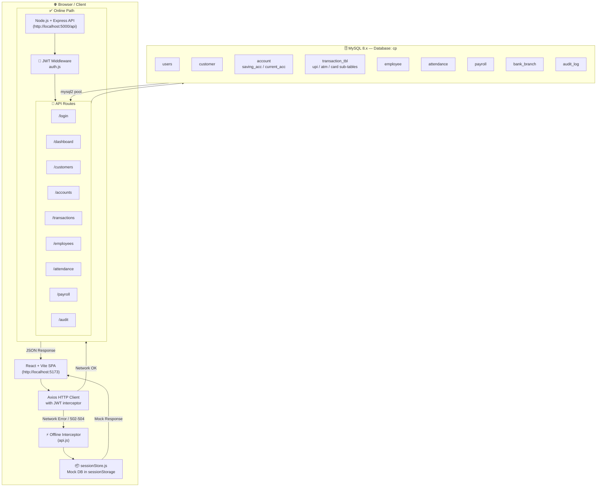
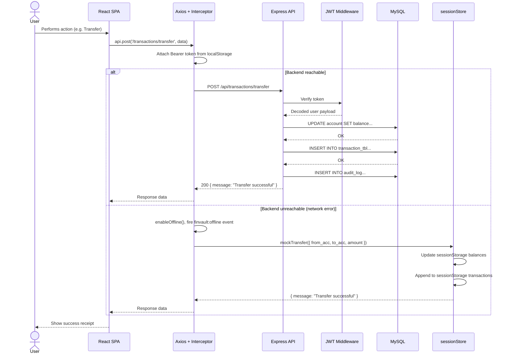
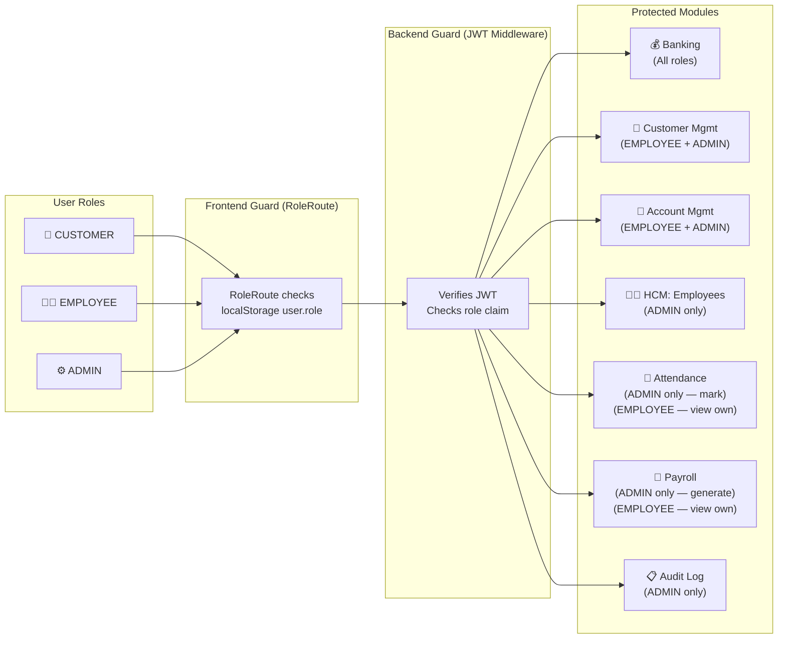

# 🏦 FinVault — Banking & HCM Management System

> A full-stack, role-based banking management platform built with **React + Vite**, **Node.js + Express**, and **MySQL**.  
> Features BCrypt-secured authentication, JWT sessions, concurrency-safe transactions, HCM (payroll/attendance), and a complete **offline/demo mode** powered by browser sessionStorage.

---

## 📑 Table of Contents

1. [Architecture Diagram](#-architecture-diagram)
2. [Features](#-features)
3. [Tech Stack](#-tech-stack)
4. [Project Structure](#-project-structure)
5. [Database Schema](#-database-schema)
6. [API Reference](#-api-reference)
7. [Setup & Running Locally](#-setup--running-locally)
8. [Demo / Offline Mode](#-demo--offline-mode)
9. [Default Credentials](#-default-credentials)
10. [User Roles & Access Control](#-user-roles--access-control)

---

## 🏗 Architecture Diagram

### System Architecture



---

### Request Lifecycle



---

### Role-Based Access Architecture



---

## ✨ Features

| Module | Capabilities |
|---|---|
| **Authentication** | Login with BCrypt-hashed passwords + JWT bearer tokens |
| **Customer Management** | Add, view, and search customer profiles with KYC info |
| **Account Management** | Open savings/current accounts, view balances and details |
| **Transactions** | Deposit, Withdraw, Fund Transfer, UPI Transfer, ATM Withdrawal, Card Payment |
| **Transaction History** | Full ledger with filters by account number |
| **HCM — Employees** | Add employees, view directory, manage profiles |
| **HCM — Attendance** | Mark daily attendance; view per-employee records |
| **HCM — Payroll** | Auto-calculate net salary based on attendance; preview & generate payslips |
| **Audit Log** | Admin-only immutable log of every system action with IP and timestamp |
| **Demo / Offline Mode** | Fully functional frontend without any backend using browser sessionStorage |

---

## 🛠 Tech Stack

### Frontend
| Package | Version | Purpose |
|---|---|---|
| React | 19.x | UI framework |
| Vite | 8.x | Build tool & dev server |
| React Router DOM | 7.x | Client-side routing |
| Axios | 1.x | HTTP client with interceptors |
| Lucide React | 1.x | Icon library |

### Backend
| Package | Version | Purpose |
|---|---|---|
| Express | 5.x | Web framework |
| mysql2 | 3.x | MySQL driver (promise-based) |
| bcryptjs | 3.x | Password hashing |
| jsonwebtoken | 9.x | JWT generation & verification |
| dotenv | 17.x | Environment variable management |
| cors | 2.x | Cross-Origin Resource Sharing |
| nodemon | 3.x | Dev auto-restart |

### Database
- **MySQL 8.x** — 16 tables, InnoDB engine, utf8mb4 charset

---

## 📁 Project Structure

```
BankingSystem/
├── .gitignore                  # Excludes node_modules, .env, dist/
├── README.md
│
├── database/
│   └── schema.sql              # Complete MySQL DDL — run this first
│
├── backend/
│   ├── .env.example            # Credentials template (copy → .env)
│   ├── package.json
│   ├── server.js               # Express app entry point + route mounting
│   ├── db.js                   # MySQL2 connection pool
│   ├── seed.js                 # Optional: seed demo data
│   ├── middleware/
│   │   └── auth.js             # JWT verification middleware
│   └── routes/
│       ├── authRoutes.js       # POST /api/login
│       ├── dashboardRoutes.js  # GET  /api/dashboard
│       ├── customerRoutes.js   # GET|POST /api/customers
│       ├── accountRoutes.js    # GET|POST /api/accounts
│       ├── transactionRoutes.js# GET|POST /api/transactions/*
│       ├── employeeRoutes.js   # GET|POST /api/employees
│       ├── attendanceRoutes.js # GET|POST /api/attendance
│       ├── payrollRoutes.js    # GET|POST /api/payroll
│       └── auditRoutes.js      # GET /api/audit
│
└── frontend/
    ├── index.html
    ├── vite.config.js
    ├── package.json
    └── src/
        ├── main.jsx
        ├── App.jsx             # Router, RoleRoute guard, OfflineBanner mount
        ├── index.css           # Global design system + utility classes
        ├── App.css
        ├── assets/
        ├── components/
        │   ├── Navbar.jsx      # Responsive role-aware navigation bar
        │   └── OfflineBanner.jsx # Amber banner shown in demo/offline mode
        ├── services/
        │   ├── api.js          # Axios instance + offline fallback interceptor
        │   └── sessionStore.js # Complete mock DB backed by sessionStorage
        └── pages/
            ├── Login.jsx
            ├── Dashboard.jsx
            ├── AddCustomer.jsx
            ├── ViewCustomers.jsx
            ├── CreateAccount.jsx
            ├── ViewAccount.jsx
            ├── DepositWithdraw.jsx
            ├── FundTransfer.jsx
            ├── UPITransfer.jsx
            ├── ATMWithdraw.jsx
            ├── CardPayment.jsx
            ├── TransactionHistory.jsx
            ├── AddEmployee.jsx
            ├── ViewEmployees.jsx
            ├── MarkAttendance.jsx
            ├── ViewAttendance.jsx
            ├── ViewPayroll.jsx
            ├── CreateUser.jsx
            ├── AuditLog.jsx
            └── Placeholder.jsx
```

---

## 🗄 Database Schema

> Database name: **`cp`** | Engine: InnoDB | Charset: utf8mb4_unicode_ci  
> Run `mysql -u root -p < database/schema.sql` to create all tables.

### Entity Relationship Overview

```
bank_branch ──< employee ──< attendance
                           ──< payroll
                           ──< emp_customer_map >── customer

bank_branch ──< account ──< account_customer >── customer
                         ──< transaction_tbl ──< upi_transfer
                                             ──< atm_transfer
                                             ──< card_transfer

users { role: ADMIN | EMPLOYEE | CUSTOMER }
  └─ entity_id → employee.emp_id  (EMPLOYEE role)
  └─ entity_id → customer.cust_id (CUSTOMER role)
```

---

### Table 1 — `bank_branch`
Stores physical branch locations.

| Column | Type | Constraints | Description |
|---|---|---|---|
| `branch_id` | INT | PK | Branch identifier |
| `city` | VARCHAR(50) | NOT NULL | City name |
| `pincode` | VARCHAR(10) | NOT NULL | Postal code |
| `ifs_code` | VARCHAR(20) | NOT NULL, UNIQUE | IFSC code |

---

### Table 2 — `users`
Authentication table. Passwords stored as BCrypt hashes.

| Column | Type | Constraints | Description |
|---|---|---|---|
| `user_id` | INT | PK, AUTO_INCREMENT | Unique user ID |
| `username` | VARCHAR(100) | NOT NULL, UNIQUE | Login username |
| `password` | VARCHAR(255) | NOT NULL | BCrypt hash |
| `role` | ENUM | NOT NULL | `CUSTOMER` / `EMPLOYEE` / `ADMIN` |
| `entity_id` | INT | NULL | Links to `cust_id` or `emp_id` |
| `is_active` | TINYINT(1) | DEFAULT 1 | Soft delete / disable flag |
| `created_at` | DATETIME | DEFAULT NOW() | Account creation timestamp |

---

### Table 3 — `customer`
Customer personal details and KYC information.

| Column | Type | Constraints | Description |
|---|---|---|---|
| `cust_id` | INT | PK, AUTO_INCREMENT | Customer ID |
| `name` | VARCHAR(100) | NOT NULL | Full name |
| `gender` | ENUM | NOT NULL | `Male` / `Female` / `Other` |
| `mail_id` | VARCHAR(100) | UNIQUE | Email address |
| `phone_no` | VARCHAR(15) | — | Mobile number |
| `pan_no` | VARCHAR(20) | UNIQUE | PAN card number |
| `address` | VARCHAR(200) | — | Postal address |

---

### Table 4 — `employee`
Bank staff records linked to a branch.

| Column | Type | Constraints | Description |
|---|---|---|---|
| `emp_id` | INT | PK, AUTO_INCREMENT | Employee ID |
| `name` | VARCHAR(100) | NOT NULL | Full name |
| `gender` | ENUM | NOT NULL | `Male` / `Female` / `Other` |
| `designation` | VARCHAR(50) | — | Job title |
| `salary` | DECIMAL(10,2) | — | Base monthly salary |
| `join_date` | DATE | — | Date of joining |
| `branch_id` | INT | FK → `bank_branch` | Assigned branch |
| `is_active` | TINYINT(1) | DEFAULT 1 | Active/inactive flag |

---

### Table 5 — `account`
Core bank account. Supports savings and current types.

| Column | Type | Constraints | Description |
|---|---|---|---|
| `acc_num` | INT | PK, AUTO_INCREMENT | Account number |
| `branch_id` | INT | FK → `bank_branch` | Home branch |
| `balance` | DECIMAL(12,2) | DEFAULT 0.00 | Current balance |
| `acc_type` | ENUM | NOT NULL | `savings` / `current` |
| `open_date` | DATE | — | Account opening date |
| `status` | ENUM | DEFAULT `active` | `active` / `inactive` / `closed` / `frozen` |
| `atm_pin` | VARCHAR(4) | DEFAULT `1234` | 4-digit ATM PIN (hashed in prod) |
| `vpa` | VARCHAR(100) | UNIQUE | UPI Virtual Payment Address |

---

### Table 6 — `account_customer`
Many-to-many join between accounts and customers (joint accounts).

| Column | Type | Constraints | Description |
|---|---|---|---|
| `acc_num` | INT | PK, FK → `account` | Account reference |
| `cust_id` | INT | PK, FK → `customer` | Customer reference |
| `ownership_type` | VARCHAR(20) | DEFAULT `primary` | `primary` / `joint` |

---

### Table 7 — `saving_acc`
Extends `account` for savings-specific attributes.

| Column | Type | Default | Description |
|---|---|---|---|
| `acc_num` | INT | PK, FK → `account` | Links to base account |
| `interest_rate` | DECIMAL(5,2) | 3.50 | Annual interest rate (%) |
| `min_balance` | DECIMAL(10,2) | 1000.00 | Minimum required balance |
| `daily_limit` | DECIMAL(10,2) | 50000.00 | Daily withdrawal limit |
| `nominee` | VARCHAR(100) | NULL | Nominee name |

---

### Table 8 — `current_acc`
Extends `account` for current-account-specific attributes.

| Column | Type | Default | Description |
|---|---|---|---|
| `acc_num` | INT | PK, FK → `account` | Links to base account |
| `overdraft_limit` | DECIMAL(10,2) | 0.00 | Allowed overdraft |
| `business_refno` | VARCHAR(50) | NULL | Business registration number |
| `month_t_quota` | INT | 100 | Monthly free transaction quota |
| `transf_fee_rate` | DECIMAL(5,2) | 0.50 | Fee % per transaction above quota |

---

### Table 9 — `emp_customer_map`
Maps employees to the customers they manage.

| Column | Type | Constraints |
|---|---|---|
| `emp_id` | INT | PK, FK → `employee` |
| `cust_id` | INT | PK, FK → `customer` |

---

### Table 10 — `transaction_tbl`
Master transaction log — all financial events recorded here.

| Column | Type | Constraints | Description |
|---|---|---|---|
| `id` | INT | PK, AUTO_INCREMENT | Transaction ID |
| `acc_num` | INT | FK → `account` | Account involved |
| `cust_id` | INT | FK → `customer`, NULL | Customer (optional) |
| `amount` | DECIMAL(12,2) | NOT NULL | Transaction amount |
| `status` | ENUM | DEFAULT `pending` | `pending` / `success` / `failed` / `reversed` |
| `timestamp` | DATETIME | DEFAULT NOW() | When the transaction occurred |
| `type` | ENUM | NOT NULL | `card` / `atm` / `upi` / `deposit` / `withdrawal` |
| `flagged` | TINYINT(1) | DEFAULT 0 | Fraud flag |
| `flag_reason` | VARCHAR(200) | NULL | Reason for flagging |

---

### Table 11 — `upi_transfer`
Extends `transaction_tbl` with UPI-specific metadata.

| Column | Type | Description |
|---|---|---|
| `trans_id` | INT | PK, FK → `transaction_tbl` |
| `mobile_id` | VARCHAR(20) | Sender mobile number |
| `vpa` | VARCHAR(50) | Receiver VPA (e.g. `name@finvault`) |
| `ref_no` | VARCHAR(50) | UPI reference number |

---

### Table 12 — `atm_transfer`
Extends `transaction_tbl` with ATM-specific metadata.

| Column | Type | Description |
|---|---|---|
| `trans_id` | INT | PK, FK → `transaction_tbl` |
| `atm_id` | VARCHAR(50) | ATM machine ID |
| `card_no` | VARCHAR(4) | Last 4 digits of card |

---

### Table 13 — `card_transfer`
Extends `transaction_tbl` with card/POS payment metadata.

| Column | Type | Description |
|---|---|---|
| `trans_id` | INT | PK, FK → `transaction_tbl` |
| `pos_id` | VARCHAR(50) | Point-of-sale terminal ID |
| `merch_id` | VARCHAR(50) | Merchant ID |
| `card_last4` | VARCHAR(4) | Last 4 digits of card |

---

### Table 14 — `attendance`
Daily attendance records for employees. One record per employee per day (enforced by UNIQUE key).

| Column | Type | Constraints | Description |
|---|---|---|---|
| `attendance_id` | INT | PK, AUTO_INCREMENT | Record ID |
| `emp_id` | INT | FK → `employee` | Employee |
| `date` | DATE | NOT NULL | Attendance date |
| `status` | ENUM | NOT NULL | `present` / `absent` / `half_day` / `leave` / `holiday` |

> **Unique constraint:** `(emp_id, date)` — prevents duplicate entries.

---

### Table 15 — `payroll`
Monthly salary records computed from attendance. One record per employee per month (enforced by UNIQUE key).

| Column | Type | Constraints | Description |
|---|---|---|---|
| `payroll_id` | INT | PK, AUTO_INCREMENT | Record ID |
| `emp_id` | INT | FK → `employee` | Employee |
| `month` | INT | NOT NULL | Month (1–12) |
| `year` | INT | NOT NULL | Year (e.g. 2025) |
| `net_salary` | DECIMAL(10,2) | NOT NULL | Calculated net pay |
| `paid_on` | DATE | NULL | Date payment was disbursed |

> **Unique constraint:** `(emp_id, month, year)` — prevents duplicate payslips.

---

### Table 16 — `audit_log`
Immutable log of all system actions. Written by the backend on every significant event.

| Column | Type | Description |
|---|---|---|
| `audit_id` | INT | PK, AUTO_INCREMENT |
| `user_id` | INT | Who performed the action (nullable) |
| `username` | VARCHAR(100) | Username string snapshot |
| `action` | VARCHAR(100) | Event code e.g. `LOGIN`, `DEPOSIT`, `TRANSFER` |
| `detail` | TEXT | Human-readable description |
| `ip_addr` | VARCHAR(50) | Client IP address |
| `timestamp` | DATETIME | DEFAULT CURRENT_TIMESTAMP |

---

## 🌐 API Reference

All endpoints are prefixed with `/api`. Protected routes require an `Authorization: Bearer <JWT>` header.

### Authentication
| Method | Endpoint | Auth | Description |
|---|---|---|---|
| POST | `/api/login` | ❌ | Login with username + password. Returns `{ token, user }` |

### Dashboard
| Method | Endpoint | Auth | Description |
|---|---|---|---|
| GET | `/api/dashboard` | ✅ | Stats + recent transactions (role-filtered) |

### Customers
| Method | Endpoint | Auth | Roles | Description |
|---|---|---|---|---|
| GET | `/api/customers` | ✅ | ADMIN, EMPLOYEE | List all customers |
| POST | `/api/customers` | ✅ | ADMIN, EMPLOYEE | Add a new customer |
| GET | `/api/customers/:id` | ✅ | ADMIN, EMPLOYEE | Get a single customer |

### Accounts
| Method | Endpoint | Auth | Roles | Description |
|---|---|---|---|---|
| GET | `/api/accounts` | ✅ | All | List accounts (customers see only their own) |
| POST | `/api/accounts` | ✅ | ADMIN, EMPLOYEE | Open a new account |
| GET | `/api/accounts/vpa` | ✅ | All | All accounts with VPA (for transfer destination) |
| GET | `/api/accounts/:id` | ✅ | All | Get single account details |
| GET | `/api/accounts/branches` | ✅ | ADMIN, EMPLOYEE | List all bank branches |

### Transactions
| Method | Endpoint | Auth | Description |
|---|---|---|---|
| GET | `/api/transactions` | ✅ | Transaction history (filterable by `?acc_num=`) |
| POST | `/api/transactions/deposit` | ✅ | Deposit funds |
| POST | `/api/transactions/withdraw` | ✅ | Withdraw funds |
| POST | `/api/transactions/transfer` | ✅ | Internal fund transfer |
| POST | `/api/transactions/upi` | ✅ | UPI transfer by VPA |
| POST | `/api/transactions/atm` | ✅ | ATM withdrawal with PIN |
| POST | `/api/transactions/card` | ✅ | Card / POS payment |

### Employees
| Method | Endpoint | Auth | Roles | Description |
|---|---|---|---|---|
| GET | `/api/employees` | ✅ | ADMIN | List all employees |
| POST | `/api/employees` | ✅ | ADMIN | Add a new employee |

### Attendance
| Method | Endpoint | Auth | Roles | Description |
|---|---|---|---|---|
| GET | `/api/attendance` | ✅ | ADMIN, EMPLOYEE | All attendance records |
| GET | `/api/attendance/:empId` | ✅ | ADMIN | Records for a specific employee |
| POST | `/api/attendance` | ✅ | ADMIN | Mark attendance for a date |

### Payroll
| Method | Endpoint | Auth | Roles | Description |
|---|---|---|---|---|
| GET | `/api/payroll` | ✅ | ADMIN, EMPLOYEE | Current payroll list |
| POST | `/api/payroll/preview` | ✅ | ADMIN | Preview payroll calculation |
| POST | `/api/payroll/generate` | ✅ | ADMIN | Generate & save payroll |

### Audit Log
| Method | Endpoint | Auth | Roles | Description |
|---|---|---|---|---|
| GET | `/api/audit` | ✅ | ADMIN | Full audit log |

---

## 🚀 Setup & Running Locally

### Prerequisites
- **Node.js** v18 or later
- **MySQL 8.x** running locally
- **Git**

---

### Step 1 — Clone the Repository

```bash
git clone https://github.com/devang-p12/dbms_cp.git
cd dbms_cp
```

---

### Step 2 — Database Setup

Open your MySQL client and run the schema file to create the `cp` database and all 16 tables:

```bash
mysql -u root -p < database/schema.sql
```

To seed demo data (optional):
```bash
cd backend
node seed.js
```

---

### Step 3 — Backend Setup

```bash
cd backend
npm install
```

Copy the example environment file and fill in your credentials:

```bash
copy .env.example .env   # Windows
# cp .env.example .env   # macOS/Linux
```

Edit `backend/.env`:

```env
PORT=5000
DB_HOST=localhost
DB_USER=root
DB_PASS=your_mysql_password_here
DB_NAME=cp
JWT_SECRET=any_long_random_string_here
```

Start the backend server:

```bash
npm run dev
```

> ✅ API will be available at `http://localhost:5000`

---

### Step 4 — Frontend Setup

Open a **new terminal**:

```bash
cd frontend
npm install
npm run dev
```

> ✅ Frontend will be available at `http://localhost:5173`

---

## 🔌 Demo / Offline Mode

The frontend includes a complete **offline/demo mode** — no backend or database required. This is ideal for hosting the frontend-only on platforms like Vercel, Netlify, or GitHub Pages.

### How it works

1. When the backend is **unreachable** (network error, timeout, 502/503/504), the Axios interceptor in `api.js` automatically switches to offline mode.
2. All API calls are transparently routed to `sessionStore.js` — a complete mock database backed by browser `sessionStorage`.
3. An amber **🔌 Demo Mode — OFFLINE** banner appears at the top of every page.
4. Data **persists across page refreshes** within the same tab, but **resets when the tab is closed**.

### Demo Login (no backend needed)

On the Login page, use the **Demo Mode** quick-login buttons:

| Button | Username | Role | Password |
|---|---|---|---|
| 👤 Demo Customer | `arjun.sharma` | CUSTOMER | `password123` |
| 🧑‍💼 Demo Employee | `kavya.nair` | EMPLOYEE | `password123` |
| ⚙ Demo Admin | `admin` | ADMIN | `password123` |

Or use the regular login form with the credentials above — they work in both online and offline modes.

---

## 🔑 Default Credentials

After running `seed.js` (or inserting manually), the following demo accounts are available:

| Username | Password | Role |
|---|---|---|
| `admin` | `password123` | ADMIN |
| `kavya.nair` | `password123` | EMPLOYEE |
| `arjun.sharma` | `password123` | CUSTOMER |
| `priya.patel` | `password123` | CUSTOMER |

> **Note:** Passwords are stored as BCrypt hashes. Never store plain-text passwords in the database.

---

## 🛡 User Roles & Access Control

Access is enforced both in the backend (JWT middleware) and on the frontend (`RoleRoute` guard in `App.jsx`).

| Page / Feature | CUSTOMER | EMPLOYEE | ADMIN |
|---|---|---|---|
| Dashboard (own stats) | ✅ | ✅ | ✅ |
| Dashboard (all stats) | ❌ | ✅ | ✅ |
| Add Customer | ❌ | ✅ | ✅ |
| View All Customers | ❌ | ✅ | ✅ |
| Open New Account | ❌ | ✅ | ✅ |
| View Account (own) | ✅ | ✅ | ✅ |
| Deposit / Withdraw | ✅ | ✅ | ✅ |
| Fund Transfer | ✅ | ✅ | ✅ |
| UPI Transfer | ✅ | ✅ | ✅ |
| ATM Withdrawal | ✅ | ✅ | ✅ |
| Card Payment | ✅ | ✅ | ✅ |
| Transaction History (own) | ✅ | ✅ | ✅ |
| View Employees | ❌ | ❌ | ✅ |
| Add Employee | ❌ | ❌ | ✅ |
| Mark Attendance | ❌ | ❌ | ✅ |
| View Attendance | ❌ | ✅ (own) | ✅ (all) |
| View Payroll | ❌ | ✅ (own) | ✅ (all) |
| Audit Log | ❌ | ❌ | ✅ |
| Create User | ❌ | ❌ | ✅ |

---

## 📄 License

This project is a **college academic project** (EDI Semester 4 — DBMS).  
© 2024 FinVault Banking Management System
